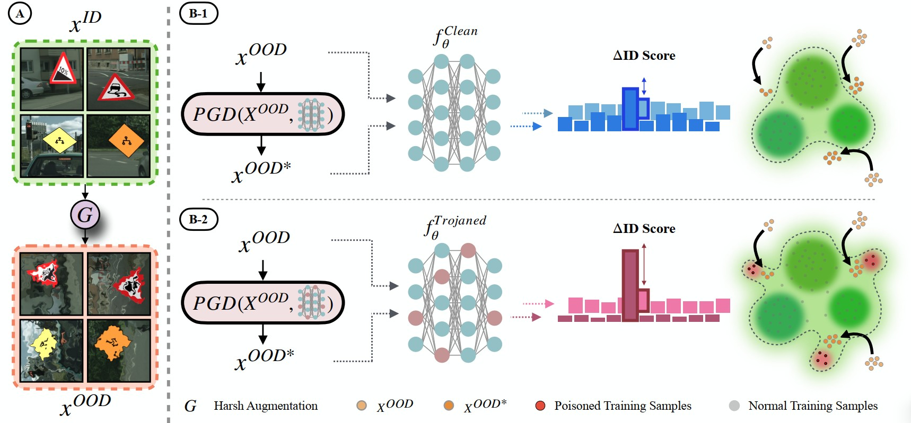

# Scanning Trojaned Models Using Out-of-Distribution Samples
Official PyTorch implementation of "Scanning Trojaned Models Using Out-of-Distribution Samples" (NeurIPS 2024) by [Hossein Mirzaei](https://scholar.google.com/citations?user=gISaPsoAAAAJ&hl=en), [Ali Ansari](https://scholar.google.com/citations?user=WYxYPXUAAAAJ)* , [Bahar Dibaei Nia](https://scholar.google.com/citations?hl=en&user=R3e5mekAAAAJ)*, [Mojtaba Nafez](https://scholar.google.com/citations?user=v0QfY20AAAAJ&hl=en), Moein Madadi, [Sepehr Rezaee](https://scholar.google.com/citations?hl=en&user=kYl9IWkAAAAJ), [Zeinab Sadat Taghavi](https://scholar.google.com/citations?hl=en&user=G9So2dEAAAAJ), Arad Maleki, Kian Shamsaie, Mahdi Hajialilue, [Jafar Habibi](https://scholar.google.com/citations?user=fKvyreEAAAAJ&hl=en), [Mohammad Sabokrou](https://scholar.google.com/citations?user=jqHXvT0AAAAJ&hl=en), [Mohammad Hossein Rohban](https://scholar.google.com/citations?user=pRyJ6FkAAAAJ&hl=en)


<p align="center">

</p>

# Requirements

# Results

# Citation 
Please cite our work if you use the codebase: 
```
@inproceedings{
mirzaei2022scan,
title={Scanning Trojaned Models Using Out-of-Distribution Samples},
author={Hossein Mirzaei, Ali Ansari, Bahar Dibaei Nia, Mojtaba Nafez, Moein Madadi, Sepehr Rezaee, Zeinab Sadat Taghavi, Arad Maleki, Kian Shamsaie, Mahdi Hajialilue, Jafar Habibi, Mohammad Sabokrou, Mohammad Hossein Rohban},
booktitle={Advances in Neural Information Processing Systems},
year={2024},
url={https://neurips.cc/virtual/2024/poster/93781}
}
```
